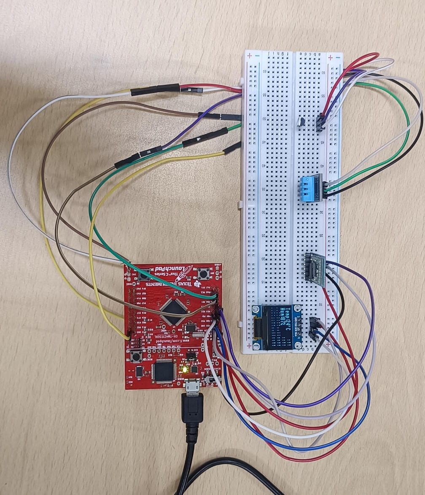
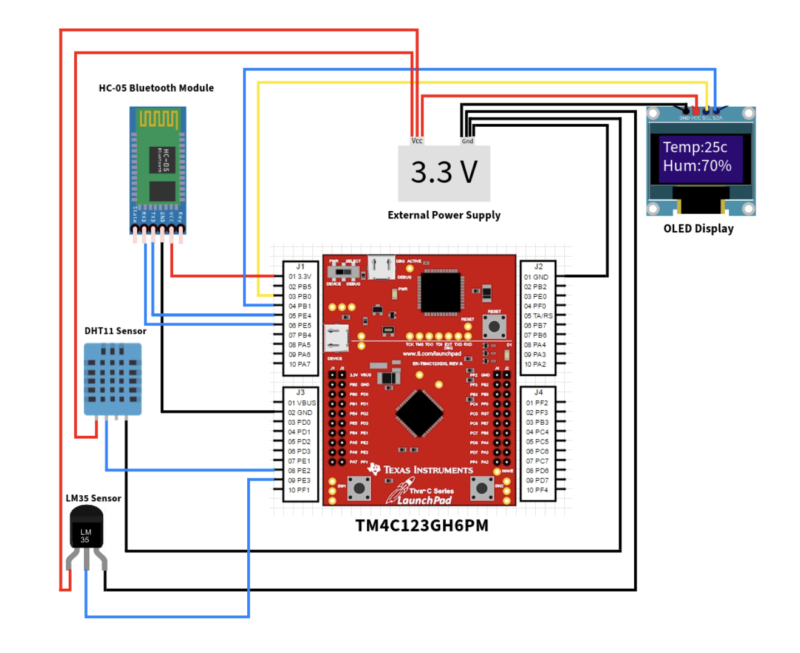
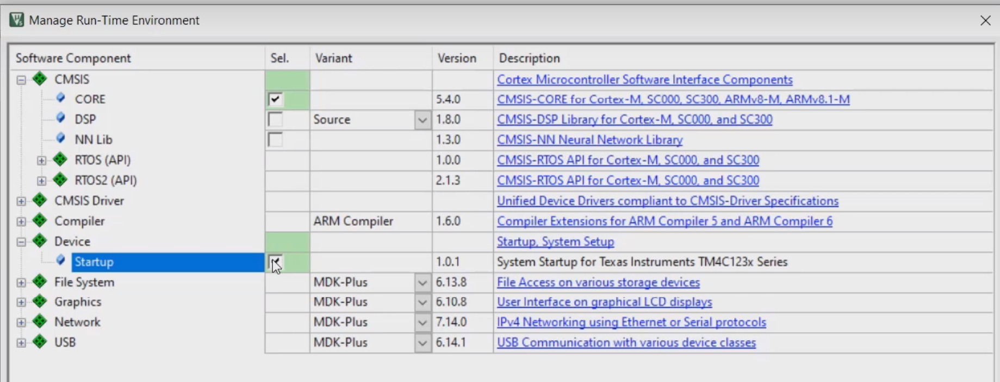
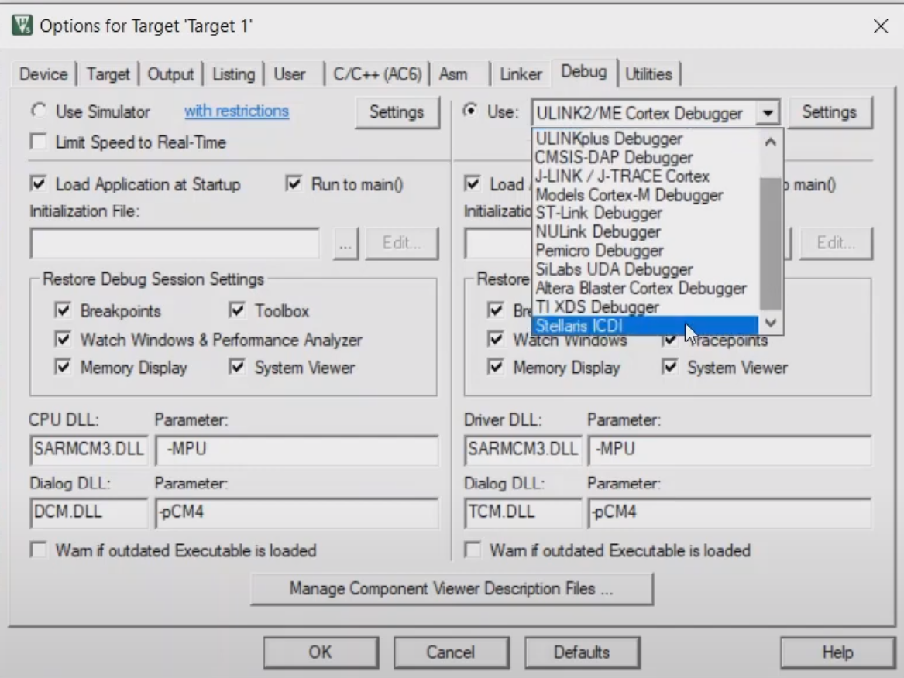

<h1 align='center'>TM4C123GH6PM Weather Monitoring System</h1>

  

A comprehensive weather monitoring system that utilizes `ADC` for efficient sensor integration, `I2C` and  `OLED` for RealTime Data Monitoring, and incorporates `Bluetooth(UART)` technology to enable wireless transmission of weather Data, fostering a reliable and user-friendly solution for real-time weather data acquisition and analysis.

## Motivation:
There is a heavy demand for remote realtime Temperature and Humidity monitoring systems in multiple fields.  
1. <b>Medical Instruments:</b> Certain medical instruments need to be stored at specific temperatures and humidity levels.  
2. <b>Food Processing:</b> Maintaining the right temperature and humidity is crucial for food safety and quality.  
3. <b>Warehouses and Cold Storages:</b> Warehouses storing temperature-sensitive products like chemicals, fruits, vegetables, food, medicines, etc., need these systems.  
4. <b>Agriculture:</b> Monitoring temperature and humidity can help optimize crop growth and prevent disease.  
5. <b>Data Centers:</b> These facilities require strict climate control to prevent overheating and ensure optimal performance.

## Circuit Diagram

  

## Features
### I2C Sensor Integration
Utilizing I2C facilitates the integration of diverse sensors, such as temperature, humidity, and atmospheric pressure, providing comprehensive weather data.
### Bluetooth Connectivity
Incorporating Bluetooth technology enables wireless communication, allowing users to access and control the system remotely, fostering increased flexibility and convenience.
### Real-time Data
The system provides real-time weather data, allowing for timely decision-making and analysis.
### User-friendly Interface
A user-friendly interface enhances accessibility, making it easier for users to interact with the system, visualize data, and configure settings.
### Scalability
The modular design allows for the addition of new sensors or features, making the system adaptable to evolving weather monitoring needs.

## Working Demo
https://github.com/Abhinav-ark/ARM_TM4C123GH6PM_Weather_Monitoring/assets/76396917/d2604c1a-f7d5-4534-a5a2-c1766f69a376

## Instructions to setup
- Make the Circuit Connections as per the Circuit Diagram.
- Create a new Tiva `TM4C123GH6PM` Project in `Keil μVision-5`.
- Select the following checkboxes in the Manage Run-Time Environment Window.

  

  

- Copy the source code file `main.c` to your Keil Project under `Target` > `Source Group`.
- Build the project (F7) and Set the Options for Target as follows

  

  

- Download the code into the Microcontroller's Flash Memory (F8) and press the Reset button on the Microcontroller to run the code. 

